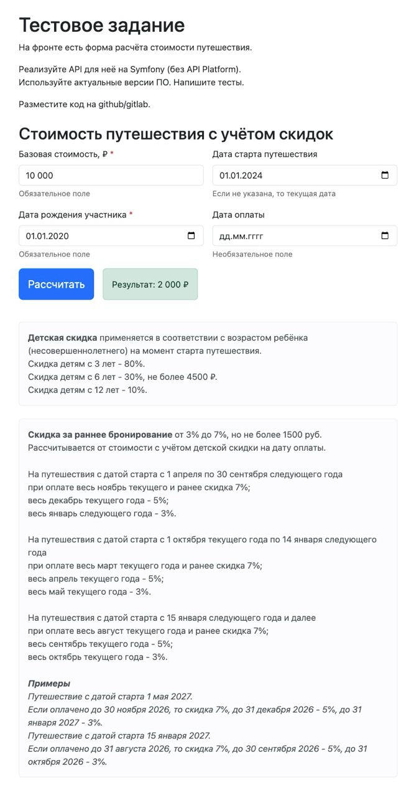

## 1. Установите Docker
в соответствии с документацией

https://docs.docker.com/engine/install/ubuntu/#install-using-the-repository

https://docs.docker.com/compose/install/

Добавьте вашего пользователя в группу 'docker'
```shell
sudo usermod -a -G docker `whoami`
```
Перезагрузитесь для применения изменений

## 2. Установите Nginx
```shell
sudo apt-get update
sudo apt-get install -y nginx
```

## 3. В корневой папке проекта

Выполните:
```shell
bash init.sh
```

для создания всех папок и контейнеров 

Следуйте инструкциям для активации/деактивации Xdebug


### Для доступа к консоли в docker контейнере 
в корневой папке проекта выполните

```shell
docker compose run --rm tour_price_cli /bin/bash
```

## 4. API доступно по адресу
http://127.0.0.1:8089/api

метод getPrice

[GET] http://127.0.0.1:8080/api/price

параметры:

**_basePrice_** - numeric-string, required

**_birthday_** - date string, required

**_startDate_** - date string, optional, default: now

**_paidDate_** - date string, optional, default: null


## 5. Разное
### XDebug настройки

Debug port: 9004 

path mappings: project root -> /var/www/tour_price


## TODO
* Добавить логирование ошибок
* Дописать тесты
* Сделать покрытие тестами
* Сделать OpenAPI документацию
* Сделать простую форму на twig


### Примечания
В проекте сделана заглушка для репозитория DiscountRepository

В тестовом задании есть логическая ошибка:

"На путешествия с датой старта с 1 апреля по 30 сентября следующего года"

"при оплате ..."

"весь январь следующего года"

С учетом того, что расчет скидки идет на дату оплаты, то в проекте использован вариант
"весь январь ТЕКУЩЕГО года"

